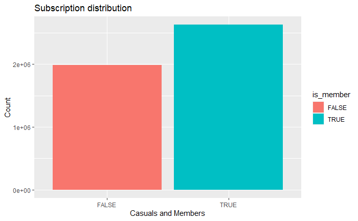
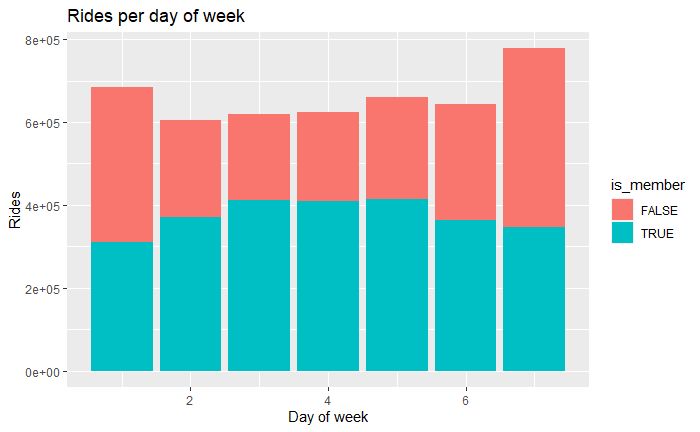

# Capstone - Google Data Analytics Course
This is the final project (capstone) of the Google Data Analytics certification that group all the key elements seen through the course. A case study is provided, where the fictional company (Cyclistic) needs to answer to a series of key business questions using data. In this imaginary situation, I am part of the marketing analytics team. My goal is to apply all the knowledge acquired in the Google Analytics course to find the answers to the questions posed. The introductory documentation can be read [here](/docs/case_study_definition.md).

## Ask step

For this study, we are trying to answer the following business questions:
* How do annual members and casual riders use Cyclistic bikes differently?
* Why would casual riders buy Cyclistic annual memberships?
* How can Cyclistic use digital media to influence casual riders to become members?

To answer this questions, we must identify the business task and consider the key stakeholders.
The statement of the business task is clear, find the key differences between member and casual riders and determine how digital media could make an impact in transforming those who are not already members.

## Prepare step

### About this dataset
The data regarding this case study has been made available by Motivate International Inc under this [licence](https://ride.divvybikes.com/data-license-agreement). It is presented in a series of csv files, one per each month. For this case, the data used is from June 2021 to July 2022, the last 12 month from the creation of this project. Each row of this dataset represents a trip from a client of the company, and it contains 13 columns (or features) providing the different details.

### ROCCC  
For a propper analysis, I followed the ROCCC guideline that ensures the data used follow this aspects:

* **Reliable**: GOOD. Our dataset has more than a million examples, it is data from all the users from Chicago city, without regard sex, nationality, culture or any other aspect that can bias the result.
* **Original**: GOOD. The data has been extracted directly from a real rental-bike company.
* **Comprehensive**: GOOD. It seems to have all the key elements to answer the business question posed.
* **Current**: GOOD. It is recently added data that ensures relevancy, and data is continuously published each month.
* **Cited**: GOOD. We know the source of all the data and who we need to address if we have any question.

## Process step
One important step is to clean the data on those errors and missing values to ensure integrity and consistency. Some techniques were applied in order to find discrepancies and to expand the available data (data aggregation).  

### Data Integrity
Importing the csv files into a relational database using SQL or as a dataframe in R offers the oportunity to check integrity easily. With this tools can be seen that some examples don't follow the rest of the sample: missing data, IDs too longs, GPS coordinates in different formats...\
This problems must be solved in order to ensure data integrity and start working on the business task.

### Data aggregation
Some new columns were created to better understand the business case:
* **ride_length**: Duration of the total ride (in seconds).
* **day_of_week**: Day of the week of the ride (1 = Sunday, 2 = Monday, ..., 7 = Saturday).
* **day**: Only the day number of the start of the ride.
* **month**: Only the month number of the start of the ride.
* **year**: Only the year number of the start of the ride.
* **hour**: The hour at which the trip was made.
* **ride_distance**: Total distance between start and end station in kilometers.

### Missing values
As for the missing values, the features related with the station (start_station_name, start_station_id, end_station_name, end_station_id) have between 836018 and 892103 missing values, this is represents a 15% of the total set.\
"end_lat" and "end_lng" also present missing values: 5374 values, this is a total of 0.09%.\
As this data was unable to replace with other stadistical operations, it was dropped from the dataset.
The rest of the available data remains completed.

### Wrong data

Doing the cleaning phase of the dataset, some wrong data arrised. This errors can be found in the columns related with the dates of the trip. Some trips ended in a previous (or same) time than the start! A quick verification is to find negative and 0 values on the newly created "ride_length" column. 646 values were detected.\
\
At this point we may ask, it is logical to have trips with a duration of a few seconds? For this case, a trip duration of less than a minute was dropped of the analysis. This criteria elevated the number of values to drop to 100420 (1.70%).\
\
The rest of the data didn't present any other complication, and other serval techniques where applied in order to check its integrity. For example, the "ride_id" column was used as a primary key, and it was checked that all of its values where unique and had a similar structure (alphanumerical values with 16 characters long).

### Data transformation

It is important to ensure that each data is represented with the correct type. As for the "member_casual" feature, the unique values are "member" and "casual". A better representation is to map this values to a boolean type: member = True, casual = False. This column was renamed as "is_member".

## Analyze step

In order to analyze our clean data, a series of statistical calculations, plots and tables where computed. Each of this functions are thoroughly explained and detailed in order to understand how they were done and what data was used for. \
\
The file containing all the analysis can be found [here](/analysis.html).

## Share step

This section presents the results obtained during the analysis phase.
It is worth recalling the objective of this study, defined in the "ask" section: Understand the different behaviour between casual and member riders and answer how to approach a digital advertising campaign to encourage more customers to become members.

### Member - casuals distribution
First, we looked at the distribution of members and casuals. There are more members, so the dataset is a bit unbalanced, but it was enough to arrive to a clear result:

### Rides per type of rider
To understand the difference in behaviour between customers, a first query could be how many trips they make. This question has been divided into different time periods (number of trips per month, day of the week...) as well as the hours of the day of more activity according to the type of user.

Here is the distribution throughout the year. The busiest periods coincide with the good weather in the spring and summer months. The low presence of casual customers in the other months, corresponding to those with the worst weather, stands out. 

The focus has also been placed on the number of trips during the days of the week. This was the result:

Two different behaviours can be seen according to casuals and members. Casual customers tend to take more trips on weekends, while for members it is the other way around. This behaviour suggests that members use the bicycle more on weekdays, which may be to go to work or school, while casuals enjoy it more in their free time (weekends).
This hypothesis is further confirmed if we look at the distribution throughout the day:

A lot of activity is observed from 8AM to 7PM, also there are important peaks around those two hours by member riders, coinciding with peak start and end times for work or school. Casual cyclists have a more even distribution during the day and have more of a presence in the evening hours.

### Time spent on rides
Apart from the number of trips, it is also very interesting to see the time spent on each trip:

This graph shows something very relevant: casual cyclists spend much more time on their trips than members except during peak work and school hours, where members equal or exceed casual riders. The following table shows the average time by type of rider:

PHOTO TABLE

The casual cyclist's travel time is more than double that of members, totaling 28 and 13 minutes respectively. This behaviour can help to clearly differentiate between the two customer groups, and should be a characteristic to consider when designing the advertising campaign.

### Type of ride
 
In reference to the type of bicycle, the average time spent on each one and the distance traveled was calculated:

PHOTO TABLE
PHOTO TABLE

Docked bikes are the most used, but this is because when they are docked the time still runs until they are parked to a proper station. Rides with classic bikes tend to be longer than the electric ones. They are not only a 21% faster, but they also do an average of an extra 400m compared with clients that stick with classic bikes.

### Favourite destinations
From de GPS data, we can check which are the favourite destinations:

We can focus our ad campaign on that stations to reach to more clients.

### Summary
* Members are more active on weekdays, especially during peak work or school hours (8AM and 7PM).
* The weather factor is strongly correlated with the number of trips taken, with the months between April and October being the busiest months. Specifically, casual riders are much more affected by this effect, their presence is much lower in the fall and winter months and vice versa.
* Casual riders are more active on weekends and in the evening they have more presence than members.
* The most visited destination is Navy Pier.
* The average trip time for casual riders is more than twice that of members.
* Classic bike trips are the most used, but electric bikes are 21% faster and travel an average of 400m more.
